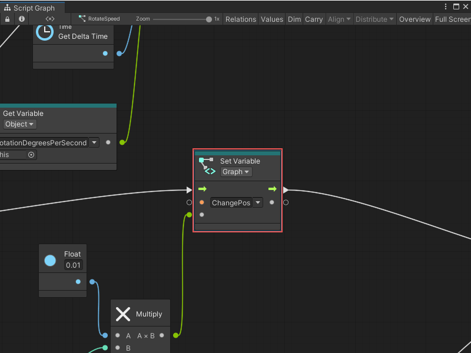
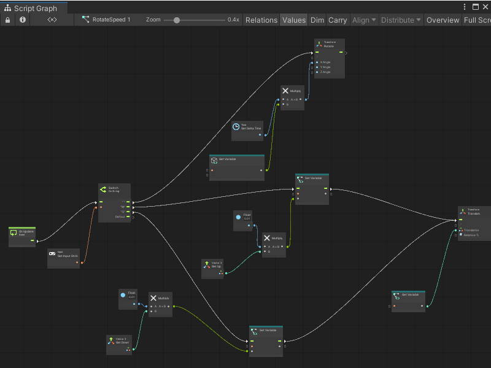
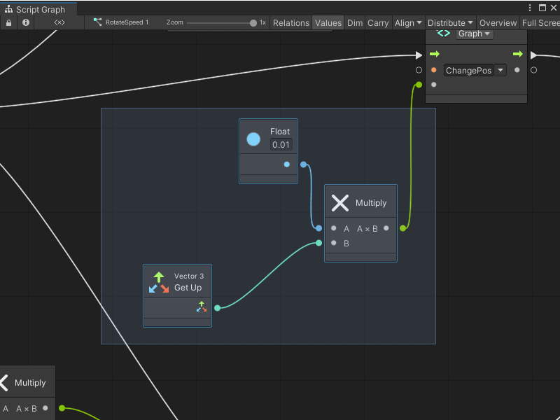
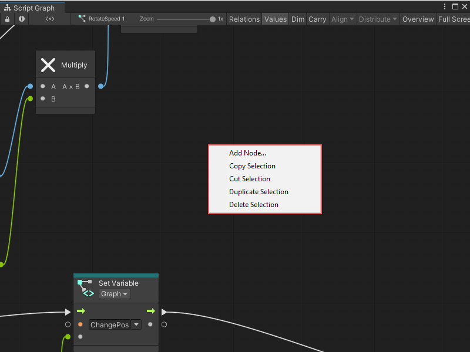
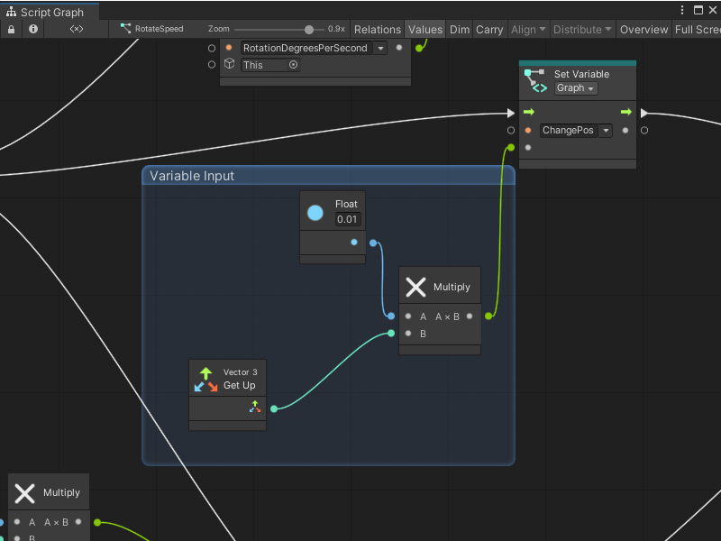
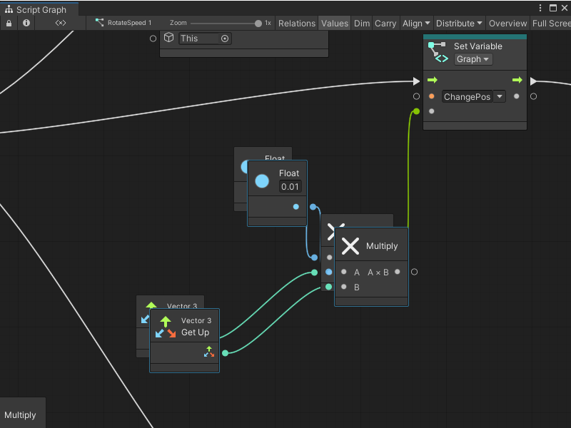
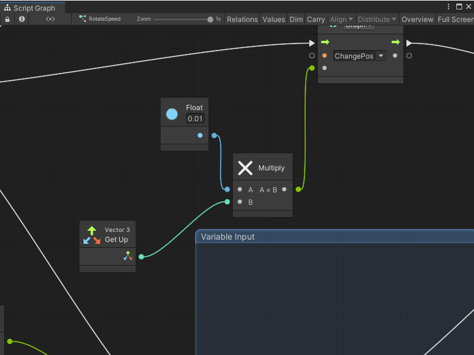

# Choose a control scheme

You can choose from two different control schemes in Visual Scripting. Each control scheme changes how you can interact with your graphs in the Graph Editor: 

|**Action** |**Default Control Scheme** |**Alternate Control Scheme** |
|:---|:---|:---|
|[**Pan**](#pan)| Middle-click and drag | Middle-click and drag |
|[**Pan Vertically**](#pan-vertically) | Scroll | N/A |
|[**Zoom In/Zoom Out**](#zoom-inzoom-out) | Ctrl+Scroll (macOS: Cmd+Scroll) | Scroll |
|[**Frame Selected**](#frame-selected) | Home | Home |
|[**Frame All**](#frame-all) | Home | Home |
|[**Create Selection**](#create-selection) | Click and drag | Click and drag |
|[**Select All**](#select-all) | Ctrl+A (macOS: Cmd+A)| Ctrl+A (macOS: Cmd+A) |
|[**Open Context Menu**](#open-context-menu)| Right-click  Ctrl+click (macOS)  Ctrl+E (macOS: Cmd+E) | Right-click  Ctrl + click (MacOS)  Ctrl+E (macOS: Cmd+E) |
|[**Create Node Group**](#create-node-group)| Ctrl+click and drag (macOS: Cmd+click and drag) | Ctrl+click and drag (macOS: Cmd+click and drag) |
|[**Copy Selected**](#copy-selected)| Ctrl+C (macOS: Cmd+C) | Ctrl+C (macOS: Cmd+C) |
|[**Paste Selection**](#paste-selection)| Ctrl+V (macOS: Cmd+V) | Ctrl+V (macOS: Cmd+V) |
|[**Cut Selected**](#cut-selected)| Ctrl+X (macOS: Cmd+X) | Ctrl+X (macOS: Cmd+X) |
|[**Duplicate Selected**](#duplicate-selected)| Ctrl+D (macOS: Cmd+D)| Ctrl+D (macOS: Cmd+D) |
|[**Delete Selected**](#delete-selected)| Del | Del |
|[**Maximize Graph Window**](#maximize-graph-window)| Shift+Space  Double-click | Shift+Space  Double-click |
|[**Move Group Without Child Nodes**](#move-group-without-child-nodes)| Alt+click and drag the group's Title bar | Ctrl+click and drag the group's Title bar (macOS: Cmd+click and drag)|
|[**Move Node on One Axis**](#move-node-on-one-axis)| Shift+click and drag vertically or horizontally | Shift+click and drag vertically or horizontally |

## Pan 

Pan to move the viewable area in the Graph Editor to any part of your graph. 

## Pan Vertically 

With the **Default** control scheme, pan the view in the Graph Editor vertically with the scroll wheel on your mouse. 

## Zoom In/Zoom Out 

Change the zoom level in the Graph window to control how much of your graph is visible in the Graph Editor. 

You can also set your zoom level with the toolbar in the Graph window. For more information, see [The interface](vs-interface-overview.md#the-graph-toolbar).

## Frame Selected 

After you select a node or another item in your graph, press Home to center your selected item in the Graph Editor.

## Frame All 

With no nodes or items selected, press Home to center your entire graph in the Graph Editor. Your zoom level automatically adjusts to accommodate the size of your graph. 

## Create Selection

Click and drag to create a selection box around any nodes or items in your graph that you want to select. 

When you have multiple items selected, click and drag a single item to move the entire selection. 

## Select All 

Press Ctrl+A (macOS: Cmd+A) to select all items in your current graph. 

## Open Context Menu

You can open the context menu to perform certain actions on State Graphs or manipulate a selection in a Script Graph. You can create new states and add transitions.

## Create Node Group 

Create a group of nodes to keep related sections of your graph together, or move multiple nodes at a time. For more information on node groups, see [Create node groups](vs-groups.md).

## Copy Selected 

Copy your current selection to move it to another graph, or another location on your current graph. 

## Paste Selection

Paste the contents of a copied or cut selection into your graph. 
## Cut Selected

Cut your current selection to move it to another graph, or another location on your current graph. 

## Duplicate Selected 

Duplicate a selection to instantly create a copy of your current selection to use elsewhere in your current graph. 

## Delete Selected

Delete your current selection to remove it from your graph. 

## Maximize Graph Window 

After you dock the Graph window in the Unity Editor, press Shift+Space or double-click maximize your Graph window and take up the entire Editor window. 

## Move Group Without Child Nodes 

You can move a group in your graph without any of the nodes contained inside that group. 

## Move Node on One Axis 

Shift+click to move a node in only one direction at a time in the Graph Editor. The node can move either vertically or horizontally. 