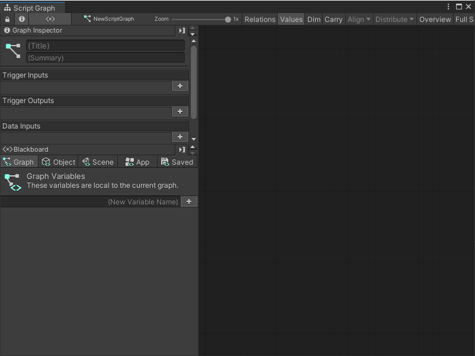

# Create a new blank graph with the Project window

You can create a new blank graph through the Project window in the Unity Editor. Your graph contains no starter nodes, and isn't connected to any existing components in your project.

For more information on other ways to create a new graph file, see [Create a new graph file](vs-create-graph.md).

To create a new blank graph: 

1. [!include[open-project-window](./snippets/vs-open-project-window.md)]

2. Right-click a folder in the Project window's folder list, or anywhere in the Project window's preview pane, and go to **Create** &gt; **Visual Scripting**.

1. Do one of the following: 

    * To create a new Script Graph, select **Script Graph**. 
    * To create a new State Graph, select **State Graph**. 

3. Enter a name for the new graph.

1. Press Enter.

When you open the new graph file, the graph might look similar to the following example.

## Next steps 

After you create a new graph, attach it to a Script Machine or State Machine to use it in your application. For more information, see [Attach a graph file to a Script Machine or State Machine](vs-attach-graph-machine.md).
