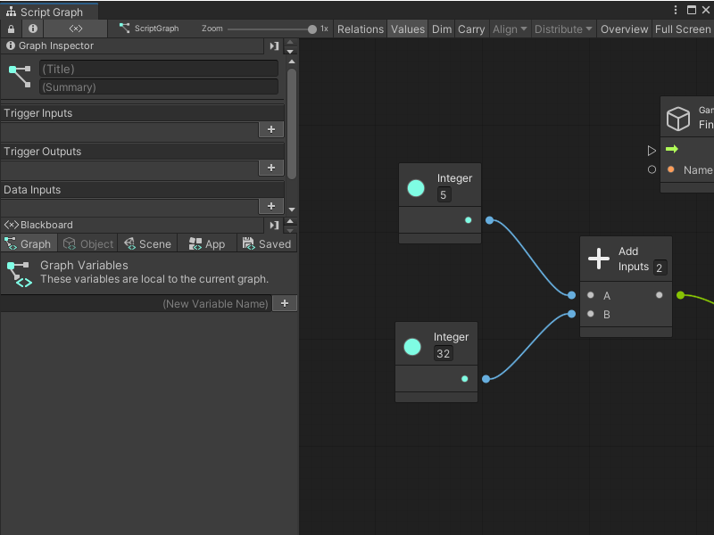
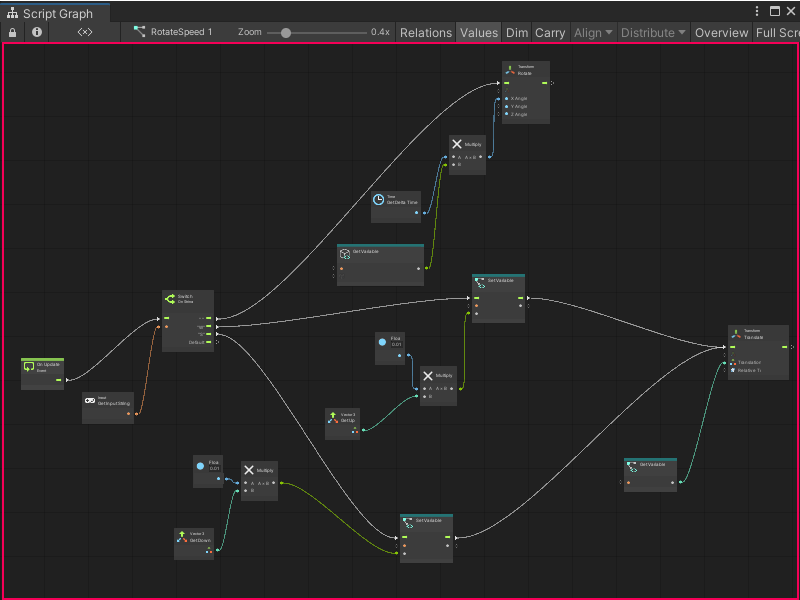
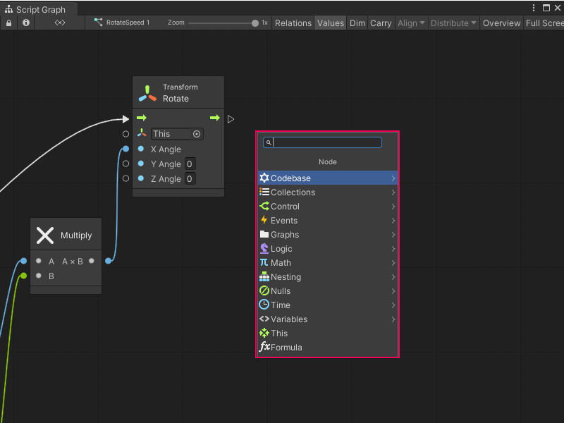
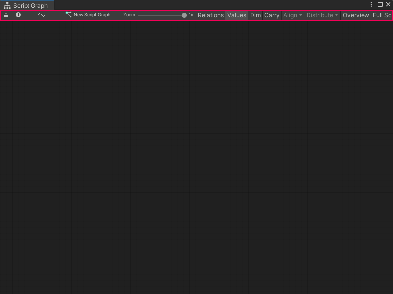
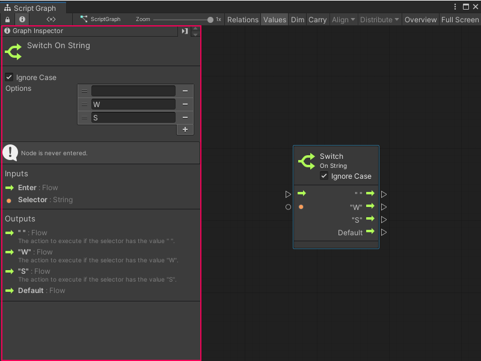
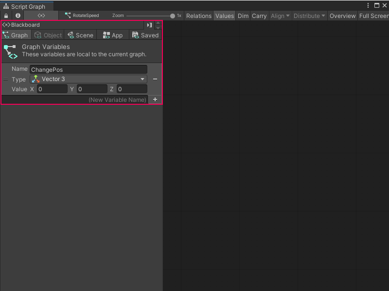

# The interface

Visual Scripting's main window is the Graph window. 

The Graph window has five main elements: 

- The [**Graph Editor**](#the-graph-editor), where you create, arrange, and connect nodes. 
- The [**fuzzy finder**](#the-fuzzy-finder), which you can use to find nodes and add them to your graph.
- The [**Graph toolbar**](#the-graph-toolbar), where you can change settings specific to your view in the Graph Editor and perform some common layout operations. 
- The [**Graph Inspector**](#the-graph-inspector), where you can view detailed information about your nodes and configure additional settings for your graph. 
- The [**Blackboard**](#the-blackboard), where you can define and edit variables to use in your graphs.  

## The Graph Editor

The Graph Editor is the center editing area of the Graph window.

You can use the Graph Editor to create your Visual Scripting graphs. You can create nodes and connect them with edges. 

You can change some default shortcuts and behaviors in the Graph Editor through your control scheme. For more information on the available control schemes in Visual Scripting, see [Choose a control scheme](vs-control-schemes.md).

## The fuzzy finder

The fuzzy finder is a searchable menu that lists every node available in Visual Scripting. Right-click anywhere in the Graph Editor to open the fuzzy finder. 

Search for a node by name with the Search bar, or open a category from the list to view related nodes. For example, nodes related to the creation or manipulation of variables are in the **Variables** category.

You can add new nodes to Visual Scripting from your own code, from other packages, or from other Unity features. For more information on how to add nodes to the fuzzy finder, see [Configure project settings](vs-configuration.md).

## The Graph toolbar 

The Graph toolbar lets you display or hide the Graph Inspector and Blackboard. The Graph toolbar also includes a breadcrumb trail for navigation through nested graphs that displays your current location. Select a graph from the trail to return to that graph file.

You can also configure some additional settings that control how nodes display in the Graph Editor.

<table>
<thead>
<tr>
<th><strong>Property</strong></th>
<th colspan="2"><strong>Description</strong></th>
</tr>
</thead>
<tbody>
<tr>
<td><strong>Lock</strong></td>
<td colspan="2">Lock the current Script Graph or State Graph to the Graph window. Visual Scripting keeps the current graph open, even if you select another GameObject with a graph file in the <a href="https://docs.unity3d.com/Manual/Hierarchy.html">Hierarchy window</a>.</td>
</tr>
<tr>
<td><strong>Graph Inspector</strong></td>
<td colspan="2">Display or hide <a href="#the-graph-inspector">the Graph Inspector</a>.</td>
</tr>
<tr>
<td><strong>Blackboard</strong></td>
<td colspan="2">Display or hide <a href="#the-blackboard">the Blackboard</a>.</td>
</tr>
<tr>
<td><strong>Breadcrumb Location</strong></td>
<td colspan="2">Displays the name of the current graph. If you open a <a href="vs-nesting-subgraphs-state-units.md">Subgraph or State Unit</a>, or a <a href="vs-graph-types.md#state-graphs">State node</a> inside a State Graph, use the breadcrumbs to navigate back to the parent graph.</td>
</tr>
<tr>
<td><strong>Zoom</strong></td>
<td colspan="2">Set a zoom level for your view of the Graph Editor.</td>
</tr>
<tr>
<td><strong>Relations</strong></td>
<td colspan="2">Enable <strong>Relations</strong> to display inner flow connections for Script Graph nodes. For example, on a standard <code>Multiply</code> node, the <strong>Relations</strong> setting draws a line from each input port that merges into a single line on the output port. The lines display the flow of data inside the node.  Disable <strong>Relations</strong> to hide these inner connections.</td>
</tr>
<tr>
<td><strong>Values</strong></td>
<td colspan="2">Enable <strong>Values</strong> to display the input and output values sent between nodes while the Unity Editor is in Play mode. This can make it easier to debug your scripts.  Disable <strong>Values</strong> to hide input and output values while in Play mode.  For more information on Play mode, see <a href="https://docs.unity3d.com/Manual/GameView.html">The Game view</a> in the Unity User Manual. 
<h5>NOTE</h5>
This setting corresponds to the <strong>Show Connection Values</strong> setting in the Preferences window for Visual Scripting. For more information on this preference, see <a href="vs-set-preferences.md#script-graphs-preferences">Configure your preferences</a>.

</td>
</tr>
<tr>
<td><strong>Dim</strong></td>
<td colspan="2">Enable <strong>Dim</strong> to dim any nodes in the Graph Editor that aren't yet connected to the control flow in your graph. The <strong>Dim</strong> setting provides you with a visual cue that a node isn't used in the current configuration of your graph.  Disable <strong>Dim</strong> to display all nodes as active regardless of their connection state. 
<h5>NOTE</h5>
This setting corresponds to the <strong>Dim Inactive Nodes</strong> setting in the Preferences window for Visual Scripting. For more information on this preference, see <a href="vs-set-preferences.md#core-preferences">Configure your preferences</a>.

</td>
</tr>
<tr>
<td><strong>Carry</strong></td>
<td colspan="2">Enable <strong>Carry</strong> to move all connected child nodes when you move a parent node. Disable <strong>Carry</strong> to only move the currently selected node.
<h5>NOTE</h5>
This setting corresponds to the <strong>Carry Children</strong> setting in the Preferences window for Visual Scripting. For more information on this preference, see <a href="vs-set-preferences.md#core-preferences">Configure your preferences</a>.

</td>
</tr>
<tr>
<td rowspan="7"><strong>Align</strong></td>
<td colspan="2">Choose an alignment option to align any nodes in your current selection.</td>
</tr>
<tr>
<td><strong>Align Left Edges</strong></td>
<td>Align all nodes in the selection based on their left edge.</td>
</tr>
<tr>
<td><strong>Align Centers</strong></td>
<td>Align all nodes in the selection based on their vertical centers.</td>
</tr>
<tr>
<td><strong>Align Right Edges</strong></td>
<td>Align all nodes in the selection based on their right edges.</td>
</tr>
<tr>
<td><strong>Align Top Edges</strong></td>
<td>Align all nodes in the selection based on their top edges.</td>
</tr>
<tr>
<td><strong>Align Middles</strong></td>
<td>Align all nodes in the selection based on their horizontal middles.</td>
</tr>
<tr>
<td><strong>Align Bottom Edges</strong></td>
<td>Align all nodes in the selection based on their bottom edges.</td>
</tr>
<tr>
<td rowspan="9"><strong>Distribute</strong></td>
<td colspan="2">Choose a distribution option to evenly distribute space between any nodes in your current selection.</td>
</tr>
<tr>
<td><strong>Distribute Left Edges</strong></td>
<td>Distribute all nodes in the selection to leave an equal distance between the left edges of each node.</td>
</tr>
<tr>
<td><strong>Distribute Centers</strong></td>
<td>Distribute all nodes in the selection to leave an equal distance between the vertical centers of each node.</td>
</tr>
<tr>
<td><strong>Distribute Right Edges</strong></td>
<td>Distribute all nodes in the selection to leave an equal distance between the right edges of each node.</td>
</tr>
<tr>
<td><strong>Distribute Horizontal Gaps</strong></td>
<td>Distribute all nodes in the selection to leave an equal-sized horizontal gap between each node. This distribution affects the space between the left and right edges of nodes.</td>
</tr>
<tr>
<td><strong>Distribute Top Edges</strong></td>
<td>Distribute all nodes in the selection to leave an equal distance between the top edges of each node.</td>
</tr>
<tr>
<td><strong>Distribute Middles</strong></td>
<td>Distribute all nodes in the selection to leave an equal distance between the horizontal middles of each node.</td>
</tr>
<tr>
<td><strong>Distribute Bottom Edges</strong></td>
<td>Distribute all nodes in the selection to leave an equal distance between the bottom edges of each node.</td>
</tr>
<tr>
<td><strong>Distribute Vertical Gaps</strong></td>
<td>Distribute all nodes in the selection to leave an equal-sized vertical gap between each node. This distribution affects the space between the top and bottom edges of nodes.</td>
</tr>
<tr>
<td><strong>Overview</strong></td>
<td colspan="2">Select <strong>Overview</strong> to automatically pan and zoom to fit all elements of your current graph within the Graph Editor.</td>
</tr>
<tr>
<td><strong>Full Screen</strong></td>
<td colspan="2">Select <strong>Full Screen</strong> when the Graph window is docked in the Unity Editor to maximize the Graph window to the full size of the Editor window.</td>
</tr>
</tbody>
</table>

Your Visual Scripting preferences can change some settings in the Graph toolbar or change how these settings behave. For example, you can control how fast the Graph Editor zooms in and out when you set a zoom level. For more information, see [Configure your preferences](vs-set-preferences.md).

## The Graph Inspector 

The Graph Inspector provides additional information about an open graph, or about any node you select in the Graph Editor.

If a node requires additional configuration, you can use the Graph Inspector to set these values. 

To display or hide the Graph Inspector, select **Graph Inspector** () from the toolbar.

To move the Graph Inspector to the other side of the Graph window, select either **Dock Right** () or **Dock Left** ().

## The Blackboard 

The Blackboard provides options to configure and manage variables in a graph. The Blackboard divides variables into five distinct scopes, across five tabs: **Graph**, **Object**, **Scene**, **App**, and **Saved**. 

For more information on the available variable scopes in Visual Scripting, see [Variables](vs-variables.md).

To display or hide the Blackboard, select **Blackboard** () from the toolbar.

To move the Blackboard to the other side of the Graph window, select either **Dock Right** () or **Dock Left** ().

