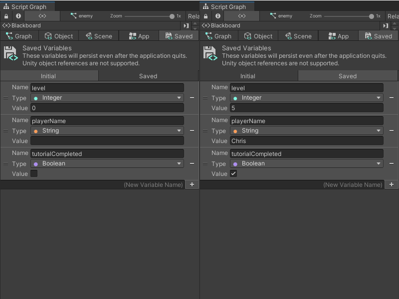

# Variables

Variables act as a container for a piece of information that might change as an application runs. To define a variable, you need to provide: 

- A name for the variable, such as `MyVariable`.
- The type of data the variable holds, such as `int` or `string` .
- A value for the variable, such as `1` or `cat`. 

In Visual Scripting, you can give a node the name of a variable, instead of a fixed value or text. Your Script Graph uses the variable's name to access its value. For example, you can use a variable called `Count`, with an `int` type and a value of `1`. You can use an Add node in Visual Scripting to add 1 to the value of `Count`, and save the new value in `Count` to use again in another part of your Script Graph, or a different Script Graph. 

Variables also have scopes. A variable's scope determines what parts of your Script Graph can access which variables to read or modify their values. The scope can also decide whether another Script Graph can access a variable. 

You can create and manage variables in a graph from the Blackboard. For more information on the Blackboard, see [The Blackboard](vs-interface-overview.md#the-blackboard). For more information on how to use variables, see [Create and add a variable to a Script Graph](vs-add-variable-graph.md).

## Variable scopes

Each variable scope has its own tab on the Blackboard, except Flow variables. Visual Scripting has six variable scopes. 

<table>
<thead>
<tr>
<th><strong>Variable Scope</strong></th>
<th><strong>Property</strong></th>
</tr>
</thead>
<tbody>
<tr>
<td><strong>Flow Variables</strong></td>
<td>Flow variables are like local variables in a scripting language: they have the smallest scope. You can't use a Flow variable if: 
<ul>
<li>The Flow variable doesn’t have a direct or indirect connection to the nodes where you want to use its value. The node where the variable is defined must be a part of the logical flow where you want to use its value.</li>
<li>The Flow variable hasn’t been set before Visual Scripting tries to run any logic that needs its value. The node where the variable is defined must come before any other logic in your graph.</li>
</ul>
You can't create a Flow variable from the Blackboard - you can create one with a Set Variable node and set the <strong>Scope</strong> to <strong>Flow</strong>.
</td>
</tr>
<tr>
<td><strong>Graph Variables</strong></td>
<td>Graph variables belong to a specific Script Graph. You can't access or modify Graph variables outside the specific Script Graph where they're defined.  You also can't create a new Graph variable unless you have a Script Graph open in the Graph window.</td>
</tr>
<tr>
<td><strong>Object Variables</strong></td>
<td>Object variables belong to a specific GameObject. You can edit an Object variable from the Unity Editor's Inspector for the GameObject, and the Object variable is accessible in all graphs attached to the GameObject.  You can't create a new Object variable unless you've opened your Script Graph from a Script Machine component on a GameObject.</td>
</tr>
<tr>
<td><strong>Scene Variables</strong></td>
<td>Scene variables belong to the current scene. Visual Scripting creates a new GameObject in your scene to hold references to your Scene variables. You can access your Scene variables from any Script Graph attached to a different GameObject in a single scene, but can't access a Scene variable in another scene in your project.</td>
</tr>
<tr>
<td><strong>App or Application Variables</strong></td>
<td>Application variables belong to your entire application. You can access an Application variable across multiple scenes while your application runs, and the Application variable would hold your changes.  Any values held in an Application variable reset to their default values after your application quits.</td>
</tr>
<tr>
<td><strong>Saved Variables</strong></td>
<td>Saved variables are like Application variables, but they persist even after your application quits. You can use a Saved variable as a simple but powerful save system. Unity stores Saved variables in its <code>PlayerPrefs</code>, and they don't refer to Unity objects, like GameObjects and components. For more information on <code>PlayerPrefs</code>, see <a href="https://docs.unity3d.com/ScriptReference/PlayerPrefs.html">PlayerPrefs</a> in the Unity User Manual Scripting Reference.</td>
</tr>
</tbody>
</table>

> [!NOTE]
> You can still access the Blackboard and create new variables with a State Graph open in the Graph window, but you can't add a variable node and use it inside a State Graph. 

For Saved variables, there are two additional tabs on the Blackboard: **Initial** and **Saved**: 

- Values defined in the **Initial** tab apply to all new instances of your application as default values. 

- Values defined in the **Saved** tab are the last modified values for those variables, based on when you last ran your application. You can edit them manually, or delete the values to reset them to the values defined in the **Initial** tab. 

